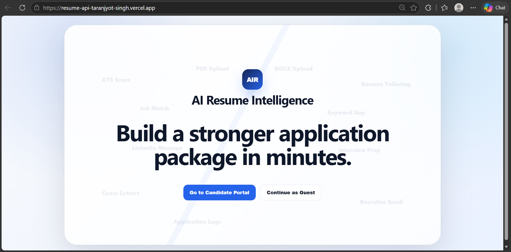
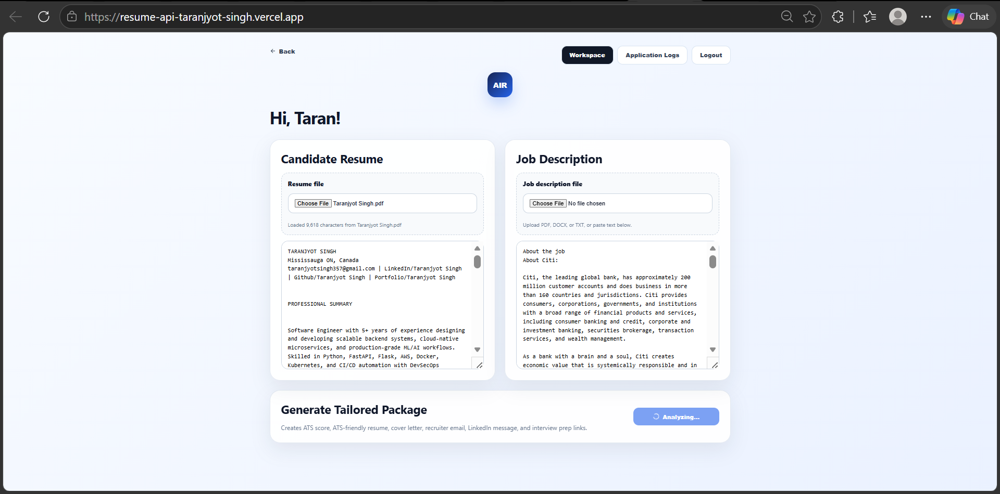
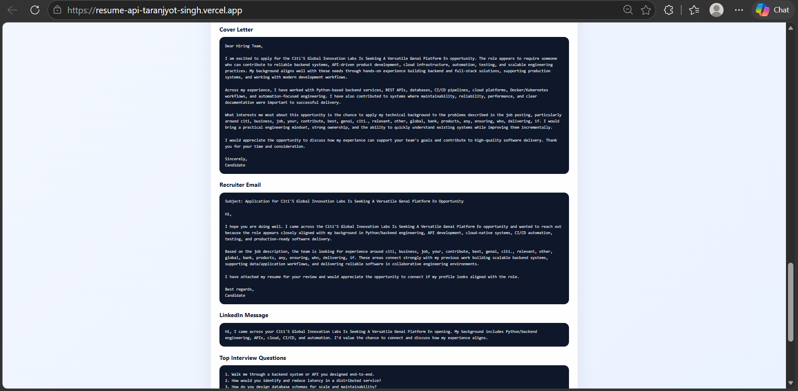
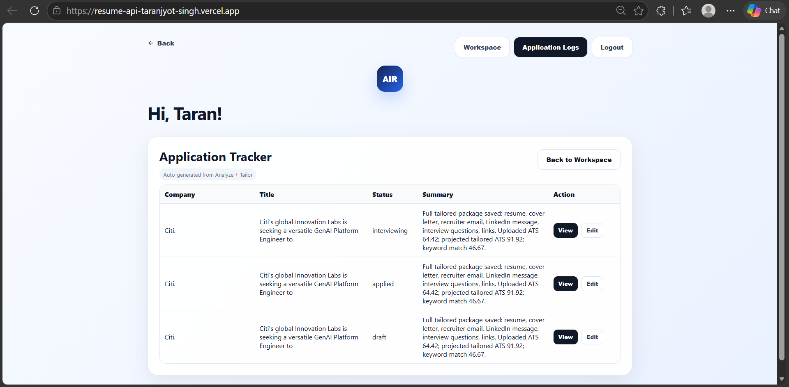
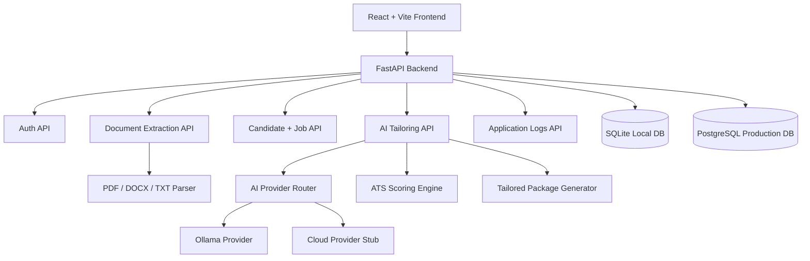

<div align="center">

# 🤖 AI Resume Intelligence

### Production-ready AI resume tailoring platform for ATS scoring, personalized application packages, and candidate application tracking.

<p>
  
  
  
</p>

<p>
  
  
  
</p>

<p>
  
  
  
</p>

<p>
  <a href="#-overview">Overview</a> •
  <a href="#-features">Features</a> •
  <a href="#-screenshots">Screenshots</a> •
  <a href="#-architecture">Architecture</a> •
  <a href="#-quick-start">Quick Start</a> •
  <a href="#-api-reference">API</a> •
  <a href="#-deployment">Deployment</a> •
  <a href="#-troubleshooting">Troubleshooting</a>
</p>

</div>

---

## 📌 Overview

**AI Resume Intelligence** is a full-stack AI platform that helps candidates tailor resumes to job descriptions, estimate ATS alignment, generate application materials, and track role-specific application packages.

It is built as a **portfolio-grade AI engineering project** with a FastAPI backend, React frontend, Ollama-first local AI workflow, JWT authentication, document parsing, CI/CD checks, Docker support, and production deployment readiness.

---

## ✨ Features

<table>
<tr>
<td width="33%" valign="top">

### 🧠 AI Resume Tailoring

- Resume-to-job matching
- ATS keyword scoring
- Projected ATS score
- ATS-friendly resume draft
- Job-title extraction from JD text
- Role-aware tailoring logic

</td>
<td width="33%" valign="top">

### 📦 Application Package

- Personalized cover letter
- Recruiter outreach email
- LinkedIn message
- Interview questions
- Interview prep links
- Analyzer runtime display

</td>
<td width="33%" valign="top">

### 👤 Candidate Workspace

- Guest and candidate modes
- Register/login flow
- Username-based greeting
- JWT session persistence
- Auto-created application logs
- Editable tracker entries

</td>
</tr>

<tr>
<td width="33%" valign="top">

### 📄 Document Handling

- PDF upload
- DOCX upload
- TXT upload
- Resume text extraction
- Job description extraction
- Paste-text fallback

</td>
<td width="33%" valign="top">

### 🧩 Platform Engineering

- FastAPI route separation
- Provider abstraction layer
- Ollama local provider
- Cloud provider stub
- SQLite local storage
- Production DB-ready config

</td>
<td width="33%" valign="top">

### 🚀 DevOps & Quality

- GitHub Actions CI
- Jenkins pipeline support
- Pytest coverage
- Ruff linting
- Bandit security scan
- Docker Compose setup

</td>
</tr>
</table>

---

## 🧱 Tech Stack

<div align="center">

<table>
<tr>
<td align="center" width="25%">
<br/>
<b>Python</b><br/>
Backend
</td>

<td align="center" width="25%">
<br/>
<b>FastAPI</b><br/>
API Layer
</td>

<td align="center" width="25%">
<br/>
<b>React</b><br/>
Frontend
</td>

<td align="center" width="25%">
<br/>
<b>Vite</b><br/>
Frontend Build
</td>
</tr>

<tr>
<td align="center">
<br/>
<b>Ollama</b><br/>
Local AI
</td>

<td align="center">
<br/>
<b>JWT</b><br/>
Auth
</td>

<td align="center">
<br/>
<b>Docker</b><br/>
Containerization
</td>

<td align="center">
<br/>
<b>GitHub Actions</b><br/>
CI/CD
</td>
</tr>

<tr>
<td align="center">
<br/>
<b>Pytest</b><br/>
Testing
</td>

<td align="center">
<br/>
<b>Ruff</b><br/>
Linting
</td>

<td align="center">
<br/>
<b>Bandit</b><br/>
Security
</td>

<td align="center">
<br/>
<b>PostgreSQL</b><br/>
Production DB
</td>
</tr>

</table>

</div>

---

## 🌐 Live Demo

<div align="center">

|                     Frontend                  |                    Backend API Docs                   |
|-----------------------------------------------|-------------------------------------------------------|
| https://resume-api-taranjyot-singh.vercel.app | https://ai-resume-intelligence-3bvb.onrender.com/docs |

</div>

---

## 📸 Screenshots

<p align="center">
  
  
</p>

<p align="center">
  
  
</p>

---

## 🏗️ Architecture

<div align="center">



</div>

### 🔄 End-to-End Workflow

```text
User Opens Landing Page
        ↓
User Continues as Guest or Logs in as Candidate
        ↓
User Uploads/Pastes Resume and Job Description
        ↓
Backend Extracts Text and Creates Candidate/Job Context
        ↓
ATS Scoring Engine Calculates Current Alignment
        ↓
AI Provider Generates Resume, Cover Letter, Email, LinkedIn Message, and Interview Prep
        ↓
Frontend Displays Tailored Package with Runtime
        ↓
Registered Candidate Gets an Automatic Application Log
        ↓
User Reviews, Views, or Edits Application Tracker Entries
```

### System Flow

| Step |                         What Happens                            |
|------|-----------------------------------------------------------------|
|  1   | React frontend collects resume and job description content      |
|  2   | FastAPI parses uploaded files or accepts pasted text            |
|  3   | Candidate/job records are created internally for analysis       |
|  4   | ATS scoring compares resume keywords against the target JD      |
|  5   | AI provider generates role-aware application materials          |
|  6   | Registered users receive an auto-created application log        |
|  7   | Application logs store resume, JD, and tailored package summary |

---

<details>
<summary><strong>📁 Folder Structure</strong></summary>

```text
resume-ai-platform/
├── .github/
│   └── workflows/                  # GitHub Actions CI checks
├── backend/
│   ├── app/
│   │   ├── api/                    # Auth, candidate, job, document, AI, application routes
│   │   ├── core/                   # Config, DB setup, security helpers
│   │   ├── models/                 # SQLAlchemy entities
│   │   ├── providers/              # Ollama and cloud provider abstractions
│   │   ├── schemas/                # Pydantic request/response DTOs
│   │   └── services/               # Parsing, scoring, prompt, AI routing logic
│   ├── tests/                      # API, parser, scoring, and health tests
│   ├── Dockerfile
│   ├── requirements.txt
│   └── .env.example
├── frontend/
│   ├── src/
│   │   ├── main.jsx                # React app logic
│   │   └── style.css               # Responsive UI styling
│   ├── Dockerfile
│   ├── package.json
│   └── vercel.json
├── infra/
│   └── jenkins/
│       └── Jenkinsfile             # Jenkins pipeline definition
├── postman/
│   └── Resume-AI-Platform.postman_collection.json
├── docs/
│   └── screenshots/
├── docker-compose.yml
└── README.md
```

</details>

---

## ⚡ Quick Start

### Prerequisites

| Requirement |          Version         |
|-------------|--------------------------|
| Python      | 3.11+ / 3.12 recommended |
| Node.js     | 20.19+ or 22.12+         |
| Ollama      | Local model runtime      |
| Docker      | Optional                 |
| Git         | Any recent version       |

---

### 1. Start Ollama

Ollama may already be running in the background.

```bash
ollama list
```

Pull the required local models:

```bash
ollama pull llama3.1:8b
ollama pull nomic-embed-text
```

Start Ollama if needed:

```bash
ollama serve
```

If you see this message:

```text
bind: Only one usage of each socket address...
```

Ollama is already running on port `11434`.

Verify the local API:

```bash
curl http://localhost:11434/api/tags
```

Test generation:

```bash
curl http://localhost:11434/api/generate \
  -d '{"model":"llama3.1:8b","prompt":"Say hello in one sentence","stream":false}'
```

---

### 2. Start Backend

```bash
cd backend
python -m venv .venv
source .venv/bin/activate
pip install -r requirements.txt
uvicorn app.main:app --reload --host 0.0.0.0 --port 8000
```

Windows PowerShell:

```powershell
cd backend
python -m venv .venv
.venv\Scripts\Activate.ps1
pip install -r requirements.txt
uvicorn app.main:app --reload --host 0.0.0.0 --port 8000
```

Open:

```text
http://localhost:8000/docs
```

---

### 3. Start Frontend

```bash
cd frontend
npm install
npm run dev
```

Open:

```text
http://localhost:5173
```

For LAN/mobile testing, open the app using your local IP:

```text
http://192.168.1.x:5173
```

---

## 🔐 Environment Variables

### Backend `.env`

```env
APP_NAME=Resume AI Platform
ENVIRONMENT=local
DATABASE_URL=sqlite:///./resume_ai.db
REDIS_URL=redis://localhost:6379/0
JWT_SECRET=auto-generate-for-local-dev
JWT_ALGORITHM=HS256
OLLAMA_BASE_URL=http://localhost:11434
DEFAULT_AI_PROVIDER=ollama
DEFAULT_GENERATION_MODEL=llama3.1:8b
DEFAULT_EMBEDDING_MODEL=nomic-embed-text
CORS_ORIGINS=http://localhost:5173,http://127.0.0.1:5173,http://localhost:3000
```

### Frontend Environment

For local development, create `frontend/.env`:

```env
VITE_API_URL=http://localhost:8000/api/v1
```

For Vercel, set this variable directly in the Vercel dashboard:

```env
VITE_API_URL=https://your-render-backend-url.onrender.com/api/v1
```

---

## 🔑 Automatic JWT Secret Handling

For local development, the backend can create `backend/.env` if it is missing and replace placeholder JWT values such as:

```env
JWT_SECRET=auto-generate-for-local-dev
JWT_SECRET=replace-this-with-a-long-random-secret
JWT_SECRET=change-me-in-production
```

with a strong generated secret.

Existing real secrets are not overwritten.

For production, set `JWT_SECRET` through the deployment platform:

- Render environment variables
- Docker/Kubernetes secrets
- AWS Secrets Manager
- Vault
- CI/CD secret stores

---

## 🧪 Tests and Quality Checks

```bash
cd backend
pytest --cov=app --cov-report=term-missing
ruff check app tests
bandit -r app -ll
```

Current backend coverage areas:

|       Area       |             Coverage              |
|------------------|-----------------------------------|
| Health checks    | API startup and readiness         |
| Auth flow        | Register/login/JWT behavior       |
| Candidate APIs   | Candidate profile creation        |
| Job APIs         | Job description creation          |
| Document parser  | PDF/DOCX/TXT extraction           |
| ATS scoring      | Keyword and projected score logic |
| Application logs | Auto-created logs and edits       |

Frontend checks:

```bash
cd frontend
npm install
npm run build
npm run lint
```

---

## 🔌 API Reference

### Health Check

```bash
curl http://localhost:8000/health
```

### Register User

```bash
curl -X POST http://localhost:8000/api/v1/auth/register \
  -H "Content-Type: application/json" \
  -d '{"username":"demo","email":"demo@example.com","password":"qwerty"}'
```

### Login

```bash
curl -X POST http://localhost:8000/api/v1/auth/login \
  -H "Content-Type: application/json" \
  -d '{"identifier":"demo","password":"qwerty"}'
```

### Create Candidate

```bash
curl -X POST http://localhost:8000/api/v1/candidates \
  -H "Content-Type: application/json" \
  -d '{"full_name":"Demo Candidate","target_role":"Python Developer","location":"Canada","resume_text":"Python FastAPI AWS Docker SQL","skills":"Python, FastAPI"}'
```

### Create Job

```bash
curl -X POST http://localhost:8000/api/v1/jobs \
  -H "Content-Type: application/json" \
  -d '{"company":"DemoCo","title":"Backend Developer","description":"Python FastAPI AWS SQL Docker APIs"}'
```

### Extract Document Text

```bash
curl -X POST http://localhost:8000/api/v1/documents/extract-text \
  -F "file=@resume.pdf"
```

### Generate Tailored Package

```bash
curl -X POST http://localhost:8000/api/v1/ai/tailor \
  -H "Content-Type: application/json" \
  -d '{"candidate_id":1,"job_id":1,"provider":"ollama","model":"llama3.1:8b"}'
```

---

## 📮 Postman

Import:

```text
postman/Resume-AI-Platform.postman_collection.json
```

Set collection variable:

```text
baseUrl = http://localhost:8000
```

Use Postman to test:

- Auth register/login
- Candidate creation
- Job creation
- Document upload/extraction
- Tailored package generation
- Application log retrieval and update

---

## 🐳 Docker

### Run Full Stack

```bash
docker compose up --build
```

### Backend Container Notes

When running directly on the host:

```env
OLLAMA_BASE_URL=http://localhost:11434
```

When running inside Docker, the backend may need host networking configuration depending on your OS:

```env
OLLAMA_BASE_URL=http://host.docker.internal:11434
```

---

## 🚀 Deployment

<table>
<tr>
<td width="50%" valign="top">

### Backend: Render

Recommended service type:

- Web Service
- Python runtime
- Root directory: `backend`
- Build command: `pip install -r requirements.txt`
- Start command: `uvicorn app.main:app --host 0.0.0.0 --port $PORT`

Production variables:

```env
ENVIRONMENT=production
DATABASE_URL=<production-db-url>
JWT_SECRET=<secure-secret>
JWT_ALGORITHM=HS256
CORS_ORIGINS=<vercel-frontend-url>
DEFAULT_AI_PROVIDER=ollama
DEFAULT_GENERATION_MODEL=llama3.1:8b
DEFAULT_EMBEDDING_MODEL=nomic-embed-text
```

</td>
<td width="50%" valign="top">

### Frontend: Vercel

Recommended settings:

- Framework preset: Vite
- Root directory: `frontend`
- Build command: `vite build`
- Output directory: `dist`

Production variable:

```env
VITE_API_URL=https://your-render-backend-url.onrender.com/api/v1
```

After changing variables, redeploy the frontend.

</td>
</tr>
</table>

---

## 🔄 CI/CD Pipeline

<table>
<tr>
<td width="20%" align="center">

### 🧪 Backend Tests

Pytest validates health routes, parsing, scoring, API flows, and application logs.

</td>
<td width="20%" align="center">

### 🧹 Backend Lint

Ruff checks code style and catches Python issues before deployment.

</td>
<td width="20%" align="center">

### 🛡️ Security

Bandit scans backend code for common Python security risks.

</td>
<td width="20%" align="center">

### ⚛️ Frontend Build

Vite build verifies the React app compiles for production.

</td>
<td width="20%" align="center">

### 🚀 Deployment Ready

Render and Vercel can auto-deploy after successful pushes.

</td>
</tr>
</table>

### GitHub Actions

The GitHub Actions workflow runs on pushes and pull requests.

Typical checks:

```text
Backend Tests, Lint, Security
Frontend Build and Lint
```

### Jenkins

The Jenkinsfile is located at:

```text
infra/jenkins/Jenkinsfile
```

Pipeline stages:

1. Backend install
2. Backend lint using Ruff
3. Backend security scan using Bandit
4. Backend tests using Pytest
5. Frontend install/build

To run Jenkins automatically on GitHub pushes:

1. Create a Jenkins Pipeline or Multibranch Pipeline job.
2. Connect it to the GitHub repository.
3. Set script path:

```text
infra/jenkins/Jenkinsfile
```

4. Configure a GitHub webhook pointing to Jenkins.
5. Add required Jenkins credentials and tools:
   - Python 3.11+
   - Node 20.19+ or 22.12+
   - npm

---

## 🧪 What This Project Demonstrates

|       Skill Area       |                     Demonstrated Through                       |
|------------------------|----------------------------------------------------------------|
| Backend Engineering    | FastAPI APIs, route separation, typed request/response schemas |
| AI Engineering         | Ollama integration, provider abstraction, prompt orchestration |
| Full-Stack Development | React workspace connected to authenticated FastAPI services    |
| Authentication         | JWT auth, username/email login, session persistence            |
| Document Processing    | PDF/DOCX/TXT extraction and normalization                      |
| Scoring Logic          | ATS score, projected score, keyword matching                   |
| Product Thinking       | Guest mode, candidate mode, application logs, mobile-ready UI  |
| DevOps                 | GitHub Actions, Jenkins, Docker, Render, Vercel                |
| Security               | JWT secrets, CORS configuration, Bandit checks                 |
| Production Readiness   | Environment config, deployment docs, troubleshooting, CI gates |

---

## 🧰 Troubleshooting

<details>
<summary><strong>Ollama says port 11434 is already in use</strong></summary>

This usually means Ollama is already running.

Verify:

```bash
curl http://localhost:11434/api/tags
ollama ps
```

If models appear, Ollama is working.

</details>

<details>
<summary><strong>AI provider unavailable</strong></summary>

Check that Ollama is running and the generation model exists:

```bash
ollama list
ollama pull llama3.1:8b
curl http://localhost:11434/api/tags
```

Also verify:

```env
OLLAMA_BASE_URL=http://localhost:11434
DEFAULT_GENERATION_MODEL=llama3.1:8b
```

</details>

<details>
<summary><strong>Register/login fails with password longer than 72 bytes</strong></summary>

Bcrypt only supports passwords up to 72 bytes.

The backend should validate or truncate safely before hashing. Use normal-length passwords during local testing and avoid accidentally passing large strings into the password field.

</details>

<details>
<summary><strong>Frontend shows Failed to fetch</strong></summary>

Common causes:

1. Frontend is still pointing to localhost.
2. Vercel variable is named incorrectly.
3. Backend CORS does not include the Vercel URL.
4. Backend deployment is sleeping or cold-starting.
5. Frontend was not redeployed after environment variable changes.

Verify frontend variable:

```env
VITE_API_URL=https://your-render-backend-url.onrender.com/api/v1
```

Verify backend CORS:

```env
CORS_ORIGINS=https://your-vercel-frontend-url.vercel.app
```

</details>

<details>
<summary><strong>Render build fails with pydantic-core / maturin / Rust errors</strong></summary>

Use a supported Python runtime and pinned dependencies.

Recommended:

```text
Python 3.12
```

Add or keep:

```text
.python-version
```

with:

```text
3.12
```

Then redeploy.

</details>

<details>
<summary><strong>Render fails with email-validator is not installed</strong></summary>

Install the missing dependency:

```bash
pip install email-validator
```

Or add it to `backend/requirements.txt`:

```txt
email-validator
```

Then commit and redeploy.

</details>

<details>
<summary><strong>Ruff reports E741 ambiguous variable name</strong></summary>

Avoid single-letter names like `l`.

Use:

```python
lines = [
    line.strip()
    for line in resume.splitlines()
    if len(line.strip()) > 20
]
```

</details>

<details>
<summary><strong>GitHub Actions cannot import app</strong></summary>

Run backend tests from the `backend` directory or set `PYTHONPATH`.

Example:

```yaml
working-directory: backend
env:
  PYTHONPATH: .
```

</details>

<details>
<summary><strong>Vercel still calls localhost after deployment</strong></summary>

Make sure the frontend code uses:

```js
const API = import.meta.env.VITE_API_URL || 'http://localhost:8000/api/v1';
```

Then set `VITE_API_URL` in Vercel and redeploy.

</details>

---

## 🔄 Recommended Clean Rebuild

### Backend

```bash
cd backend
rm -rf .venv
python -m venv .venv
source .venv/bin/activate
pip install --upgrade pip
pip install -r requirements.txt
ruff check app tests
pytest
uvicorn app.main:app --reload --host 0.0.0.0 --port 8000
```

### Frontend

```bash
cd frontend
rm -rf node_modules dist
npm install
npm run build
npm run dev
```

---

## 🗺️ Roadmap

| Priority |                                      Improvement                                         |
|----------|------------------------------------------------------------------------------------------|
|   High   | PostgreSQL production migration and persistent storage                                   |
|   High   | Cloud LLM provider implementations for OpenAI, Claude, Gemini, Azure OpenAI, and Bedrock |
|   High   | Resume export to DOCX/PDF                                                                |
|  Medium  | User profile settings and multiple resumes per candidate                                 |
|  Medium  | Application status analytics dashboard                                                   |
|  Medium  | S3-based document storage                                                                |
|  Medium  | Admin dashboard for usage metrics                                                        |
|   Low    | Kubernetes deployment manifests                                                          |
|   Low    | Terraform infrastructure templates                                                       |
|   Low    | Observability dashboards with Prometheus/Grafana                                         |

---

## 📄 License

This project is licensed under the [MIT License](LICENSE).

---

## ⚠️ Disclaimer

This project is intended for educational, portfolio, and productivity use.

AI-generated resumes, cover letters, and outreach messages should be reviewed by the user before submission. ATS scores are heuristic estimates and should not be treated as guarantees of interview selection.
